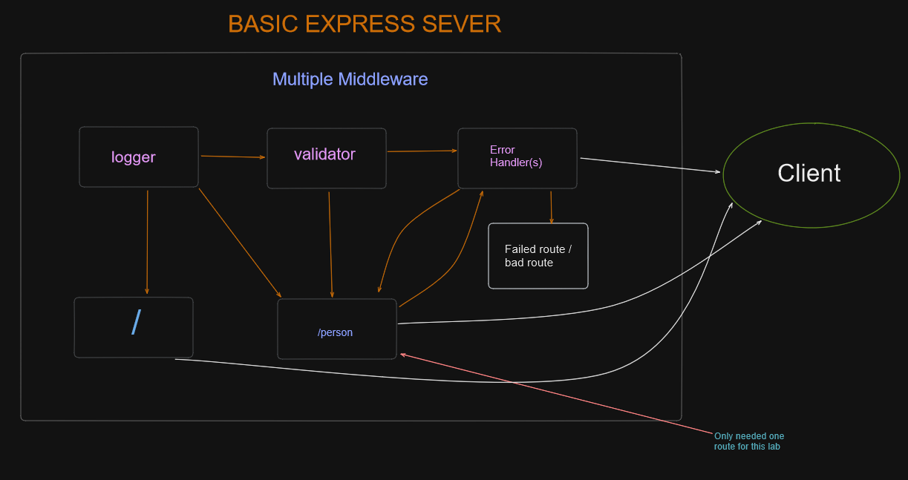

LAB - Class 02

Project: Basic Express Server
Author: Reece Renninger

Problem Domain
Developed a basic express server with a person endpoint that would only accept one query as a name.  Based off this endpoint, apply a logger to run at every route activation, attach a validator to the endpoint, and generate error handlers.

Links and Resources

  [GitHub Actions ci/cd](https://github.com/ReeceRenninger/basic-express-server)

  back-end server url (when applicable) RENDER SITES GO HERE

Collaborators

- I collaborated with Ryan and Nick from class.
- Portions of my code were inspired from Ryan G our instructor since they were the best option for that specific problem, there are comments annotating where.

Setup

- PORT variable exists within the env sample

How to initialize/run your application (where applicable)

    clone repo to local machine, npm i, npm install jest, supertest, dotenv, express. Generate an index.js and run nodemon.

Features / Routes

    GET : / - proof of life endpoint
    GET : /person - search query that requires 'Reece'

Tests

    No tests are currently implemented to be ran within terminal
    You can test endpoint by utilizing a bad route or method, implement no query string, or correct query string.

UML

